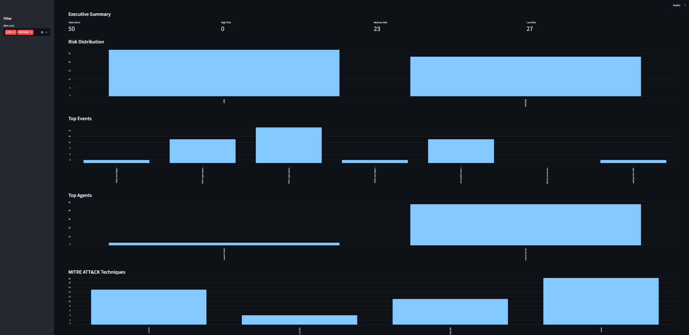
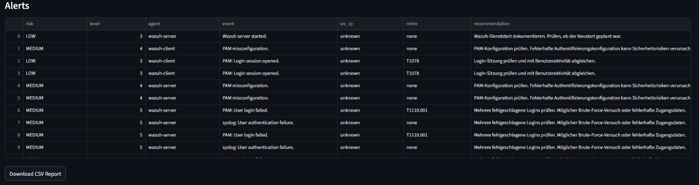
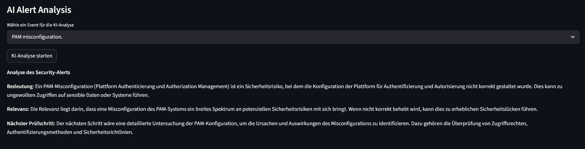

# AI Security Analyst

Ein lokales Cybersecurity-Analyse- und SOC-Showcase-Projekt mit:

- Wazuh SIEM
- Python Security Pipeline
- Streamlit Dashboard
- MITRE ATT&CK-Zuordnung
- lokaler KI-Analyse mit Ollama
- Threat Scoring
- Event Correlation
- KI-basierter Alert-Analyse

---

# Features

- Analyse echter Wazuh Security Alerts
- Risikoklassifizierung nach LOW, MEDIUM und HIGH
- Eigene Risiko-Eskalation anhand erkannter Event-Muster
- MITRE ATT&CK-Zuordnung
- KI-gestützte Alert-Erklärung
- Streamlit Dashboard
- CSV-Report-Export
- Event Aggregation
- Duplicate Detection
- SOC-artige Übersicht

---

# Dashboard-Übersicht



---

# Alert-Tabelle



---

# KI-Alert-Analyse



---

# Tech Stack

## Backend

- Python 3
- Requests
- Pandas

## Security Stack

- Wazuh SIEM
- MITRE ATT&CK
- Linux Auth Logs

## KI

- Ollama
- Llama 3.2 3B

## Frontend

- Streamlit

---

# Architektur

```text
Wazuh SIEM
    ↓
alerts.json
    ↓
Python Alert Pipeline
    ↓
Risikoklassifizierung
    ↓
MITRE ATT&CK-Zuordnung
    ↓
LLM-Analyse mit Ollama
    ↓
Streamlit Dashboard
```

---

# Installation

## Repository klonen

```bash
git clone https://github.com/n-somas/ai-security-analyst.git
cd ai-security-analyst
```

## Abhängigkeiten installieren

```bash
pip install -r requirements.txt
```

## Ollama installieren

```text
https://ollama.com/download
```

## Modell herunterladen

```bash
ollama pull llama3.2:3b
```

## Dashboard starten

```bash
streamlit run src/dashboard.py
```

---

# Beispiel-Alerts

- PAM Authentication Failure
- sudo to ROOT
- PAM Misconfiguration
- Failed Logins
- Wazuh Agent Events

---

# MITRE ATT&CK-Beispiele

| Technik | Beschreibung |
|---|---|
| T1078 | Gültige Benutzerkonten |
| T1110.001 | Password Guessing |
| T1548.003 | sudo / Rechteausweitung |

---

# Projektstatus

Aktiver Showcase für:

- SOC Analyst
- Cybersecurity Analyst
- SIEM / Blue Team
- Security Automation
- AI-assisted Security Operations

---

# Geplante Erweiterungen

- Live Alert Streaming
- Threat Intelligence Feeds
- VirusTotal Integration
- GeoIP Mapping
- PDF-Reports
- Docker Deployment
- Echtzeit-Monitoring
- Multi-Agent AI Workflow