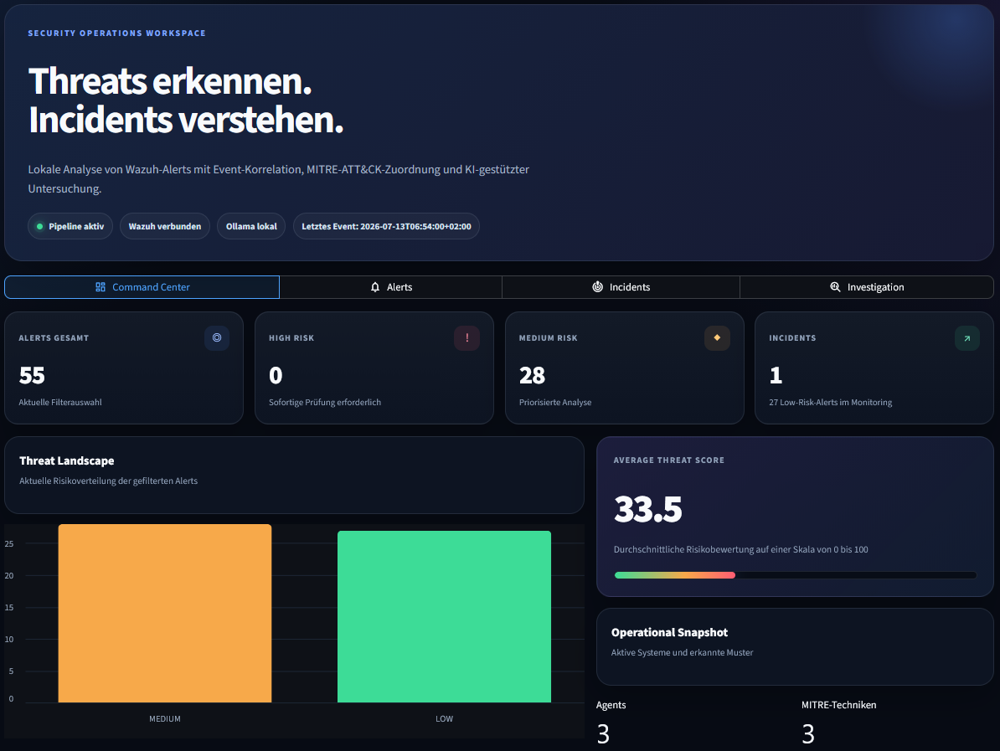
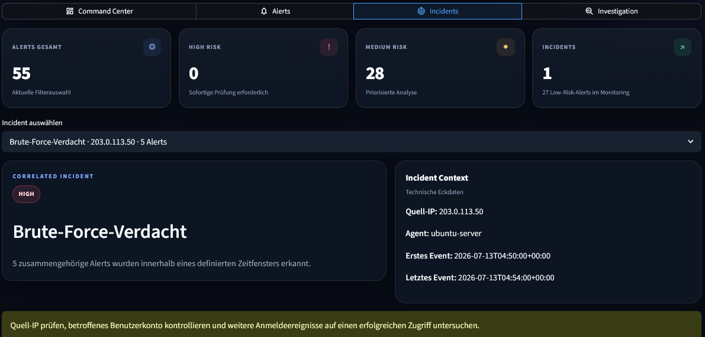
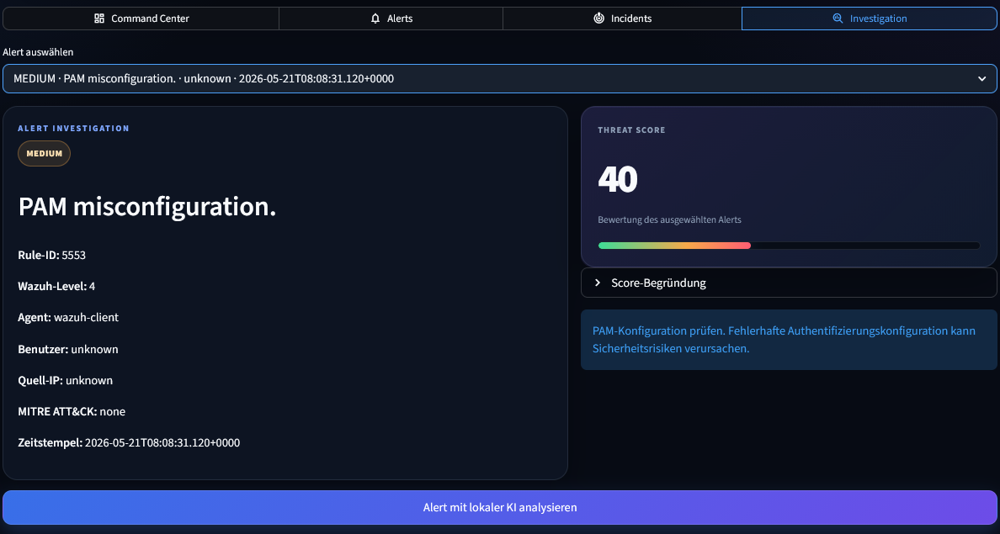

# AI Security Analyst

Lokales SOC-Showcase zur Analyse von Wazuh-Alerts mit Event-Korrelation, Threat Scoring, MITRE-ATT&CK-Zuordnung und lokaler KI-Auswertung über Ollama.

## Dashboard

### Command Center

Das Command Center zeigt die wichtigsten Kennzahlen, die aktuelle Risikoverteilung, den durchschnittlichen Threat Score sowie aktive Agents und erkannte MITRE-Techniken.



### Incident Center

Mehrere fehlgeschlagene Anmeldeversuche derselben Quell-IP werden innerhalb eines definierten Zeitfensters korreliert und als gemeinsamer Security Incident dargestellt.



### Investigation

Die Investigation-Ansicht zeigt technische Alert-Details, Threat Score, Risikobegründung, Handlungsempfehlung und die optionale lokale KI-Analyse.



## Funktionen

- Verarbeitung echter Wazuh-Security-Alerts
- Risikoklassifizierung nach `LOW`, `MEDIUM` und `HIGH`
- nachvollziehbarer Threat Score von 0 bis 100
- Event-Korrelation und Brute-Force-Erkennung
- MITRE-ATT&CK-Zuordnung
- konkrete Handlungsempfehlungen
- lokale KI-Analyse mit Ollama
- filterbare Alert-Übersicht
- Incident- und Investigation-Ansicht
- CSV-Berichtsexport
- automatisierte Tests mit Pytest

## Threat Scoring

Der Threat Score kombiniert mehrere Faktoren:

- Wazuh-Level
- bekannte Angriffsmuster
- vorhandene Quell-IP
- MITRE-ATT&CK-Zuordnung
- definierte Mindestwerte für `MEDIUM` und `HIGH`

Der Score wird auf maximal 100 Punkte begrenzt und zusammen mit einer Begründung in der Investigation-Ansicht angezeigt.

## Brute-Force-Erkennung

Ein Brute-Force-Verdacht wird erzeugt, wenn mindestens fünf fehlgeschlagene Anmeldeversuche derselben Quell-IP innerhalb von zehn Minuten erkannt werden.

Der Incident enthält:

- Risikostufe
- Incident-Typ
- Quell-IP
- betroffenen Agent
- Anzahl der korrelierten Alerts
- erstes und letztes Ereignis
- Handlungsempfehlung

## Architektur

```text
Wazuh SIEM
    |
    v
alerts_export.json
    |
    v
Python Alert Pipeline
    |
    +--> Risikoklassifizierung
    |
    +--> Threat Scoring
    |
    +--> Event-Korrelation
    |
    +--> MITRE ATT&CK
    |
    +--> lokale LLM-Analyse mit Ollama
    |
    v
Streamlit SOC Dashboard
```

## Tech Stack

### Backend

- Python 3
- Pandas
- Requests
- Pytest

### Security

- Wazuh SIEM
- MITRE ATT&CK
- Linux Authentication Logs
- regelbasierte Event-Korrelation

### KI

- Ollama
- Llama 3.2 3B

### Frontend

- Streamlit
- Altair
- eigenes Dark Theme

## Installation

### Repository klonen

```bash
git clone https://github.com/n-somas/ai-security-analyst.git
cd ai-security-analyst
```

### Abhängigkeiten installieren

```bash
python -m pip install -r requirements.txt
```

### Tests ausführen

```bash
python -m pytest -q
```

### Ollama-Modell herunterladen

```bash
ollama pull llama3.2:3b
```

### Dashboard starten

```bash
streamlit run src/dashboard.py
```

Das Dashboard ist anschließend standardmäßig unter `http://localhost:8501` erreichbar.

## Beispiel-Alerts

- PAM Authentication Failure
- PAM Misconfiguration
- User Login Failed
- Successful sudo to ROOT
- Wazuh Agent Events

## MITRE-ATT&CK-Beispiele

| Technik | Beschreibung |
|---|---|
| T1078 | Valid Accounts |
| T1110.001 | Password Guessing |
| T1548.003 | Sudo and Sudo Caching |

## Projektstatus

Aktiver Showcase für:

- SOC Analyst
- Cybersecurity Analyst
- SIEM und Blue Team
- Security Automation
- AI-assisted Security Operations

## Geplante Erweiterungen

- Live Alert Streaming
- Threat Intelligence Feeds
- VirusTotal Integration
- GeoIP Mapping
- persistentes Incident Management mit SQLite
- Docker Deployment
- PDF-Reports
- GitHub Actions
